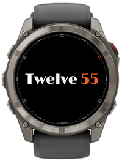
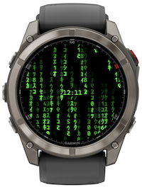
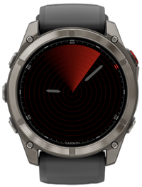

# Garmin Watch Faces

A collection of unconventional, minimalistic, elegant, open-source Garmin watch faces.

 ### Availability

The watch faces are available from the [Garmin Connect IQ Developer portal](https://apps.garmin.com/developer/84aa79b0-5787-481d-bb10-8c5015ac1158/apps).  

All faces were developed as open-source projects, and are available from GitHub. See links in the table below.

|Resource|Description|
|:-|:-|
|[Google fonts](https://fonts.google.com/)|The watch faces use open source fonts, downloaded from [Google fonts](https://fonts.google.com/) as True Type (scalable) fonts.|
|[`ttf2bmp`](https://github.com/wkusnierczyk/ttf2bmp)|Most Garmin watches do not support scalable fonts, and require bitmap fonts with specific sizes instead. For projects listed here, TTF fonts were converted to bitmaps (`.fnt` font description and `.png` font image files) using the open source tool [`ttf2bmp`](https://github.com/wkusnierczyk/ttf2bmp).|
|[`garmin-font-scaler`](https://github.com/wkusnierczyk/garmin-font-scaler)|To adapt the non-scalable bitmap fonts to various screen resolutions and shapes, the fonts were scaled using `ttf2bmp` with the open source automation tool [`garmin-font-scaler`](https://github.com/wkusnierczyk/garmin-font-scaler).|

### Collection

|Screenshot|Description|
|:-|:-|
||[**Base Time**](https://github.com/wkusnierczyk/garmin-base-time)  Current time as base _n_ numerals, _n_ = 2..16.|
||[**Binary Time**](https://github.com/wkusnierczyk/garmin-binary-time)  Current time as a grid of squares representing binary digits for hours, minutes, and seconds.|
||[**Braille Time**](https://github.com/wkusnierczyk/garmin-braille-time)  Current time as Braille digits.|
||[**Daynight Time**](https://github.com/wkusnierczyk/garmin-daynight-time)  Current time as the position of the sun across the sky, with a greeting.|
||[**English Time**](https://github.com/wkusnierczyk/garmin-english-time)  Current time as English words.|
||[**Fancyfont Time**](https://github.com/wkusnierczyk/garmin-fancyfont-time)  Current time as English word for hours and digits for minutes, in a variety of beautiful fonts.|
||[**French Time**](https://github.com/wkusnierczyk/garmin-french-time)  Current time as French Revolutionary time (Decimal time).|
||[**Matrix Time**](https://github.com/wkusnierczyk/garmin-matrix-time)  Current time with animated Digital Rain in the background.|
||[**Morse Time**](https://github.com/wkusnierczyk/garmin-morse-time)  Current time as Morse digits.|
||[**Piechart Time**](https://github.com/wkusnierczyk/garmin-piechart-time)  Current time as piecharts.|
||[**Progress Time**](https://github.com/wkusnierczyk/garmin-progress-time)  Current time as progress bars.|
||[**Radar Time**](https://github.com/wkusnierczyk/garmin-radar-time)  Current time as radar screen.|
||[**Roman Time**](https://github.com/wkusnierczyk/garmin-roman-time)  Current time as Roman numerals.|
||[**Swatch Time**](https://github.com/wkusnierczyk/garmin-swatch-time)  Time in Biel, Switzerland, as Swatch beats.|
